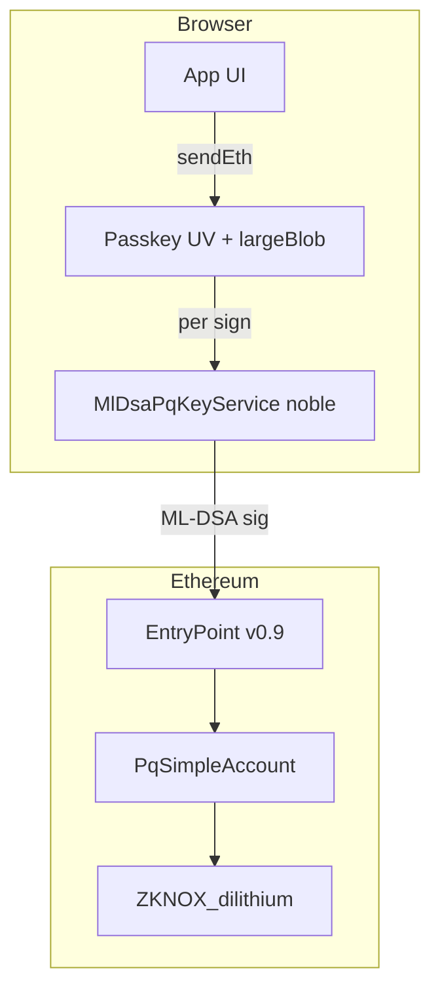

# Security Audit — pq-passkey-wallet

**Date:** 2026-06-07  
**Type:** Read-only code review  
**Scope:** Solidity contracts, WebAuthn/passkey layer, ML-DSA / ERC-4337 signing glue, dev server routes

**Out of scope:** ZKNox verifier internals (vendored lib may be absent until `vp run forge:deps`), browser/OS passkey implementations, production bundler infrastructure.

---

## Executive summary

No on-chain **signature forgery** path was found in `PqSimpleAccount` / factory logic — EntryPoint nonce binding and PQ verify gating are sound. The main risks are **off-chain custody** (plaintext seed in passkey blob), **crypto supply chain** (unaudited ZKNox ETHDILITHIUM + hand-rolled TypeScript key expansion).

This aligns with an **experimental dev wallet**, not a production-ready PQ passkey product.

**Top priorities:**

1. ~~Fail closed when no ML-DSA verifier is configured~~ — **done** (H-2).
2. ~~Remove `VITE_DEPLOYER_PRIVATE_KEY` from the client bundle~~ — **done** (H-3).
3. ~~Per-transaction WebAuthn gating — UV before every sign~~ — **done** (C-1).
4. ~~Multi-seed KAT / fuzz tests for `mlDsaDeployment` ↔ ZKNox~~ — **done** (M-5).

---

## Threat model (implicit)

| Asset            | Protection today                                      |
| ---------------- | ----------------------------------------------------- |
| PQ seed (32 B)   | Passkey `largeBlob` + user verification on read/write |
| Transaction auth | ML-DSA-44 signature over ERC-4337 `userOpHash`        |
| On-chain funds   | `PqSimpleAccount` → `ZKNOX_dilithium.verify`          |
| Session metadata | `localStorage` (public fields only)                   |

The design treats **passkey = key custody** and **ML-DSA = transaction authorization**. Each sign reads the PQ seed from `largeBlob` (passkey UV per transaction).

---

## Methodology

1. **Hypothesis generation** — enumerate likely vulnerability classes across Solidity, passkeys, and PQ crypto before deep review.
2. **Parallel audits** — three focused read-only reviews:
   - Solidity contracts (`PqSimpleAccount`, factory, deploy script)
   - WebAuthn / passkey / wallet session layer
   - ML-DSA signing, pubkey deployment encoding, AA glue, dev routes
3. **Verification** — manually confirmed critical findings (e.g. `placeholderPkPointerFromPublicKey` → `address(0)` for all keys).

---

## Architecture and trust boundaries

### Key design fact (Solidity)

`pkPointer` is the **SSTORE2 data-contract address** returned by `ZKNOX_dilithium.setKey`. An SSTORE2 pointer is a contract whose bytecode is raw key data prefixed with `0x00` (STOP) — it has **no executable logic and can never be a transaction `msg.sender`**. The verifier resolves the pointer internally to read the expanded key. SSTORE2 pointers cannot act as transaction senders; dead `msg.sender == pkPointer` branches were removed (M-1).

---

## Hypotheses and verdicts

| ID  | Area      | Hypothesis                                                                        | Verdict                                                                                      |
| --- | --------- | --------------------------------------------------------------------------------- | -------------------------------------------------------------------------------------------- |
| S1  | Solidity  | `pkPointer` as “owner” is an SSTORE2 data contract — auth bypass or bricked admin | **Resolved (partial)** — dead branches removed; admin via EntryPoint self-call only; see M-1 |
| S2  | Solidity  | No `validationData` time bounds → replay / cross-chain at account layer           | **Refuted** — `userOpHash` binds chain, EntryPoint, sender, nonce                            |
| S3  | Solidity  | CREATE2 / `pkPointer` collision lets two users share one account                  | **Refuted** — CREATE2 init code includes `pkPointer`                                         |
| S4  | Solidity  | `verifier.verify` encoding mismatch between contract and SDK                      | **Refuted** — `encodePacked(pkPointer)` matches on both sides                                |
| S5  | Solidity  | UUPS upgrade without valid PQ signature                                           | **Refuted** — upgrade needs PQ-signed UserOp self-call                                       |
| P1  | Passkey   | PQ signing not gated per-tx by WebAuthn — XSS after unlock signs freely           | **Resolved** — PQ seed not cached; passkey unlock per sign; see C-1                          |
| P2  | Passkey   | Plaintext JSON seed in `largeBlob` — no app-layer encryption                      | **Resolved (accepted)** — see H-1                                                            |
| P3  | Passkey   | `signIn` discoverable creds — no identity binding                                 | **Resolved** — stable `userId`, session check, `switchWallet`; see M-2                       |
| P4  | Passkey   | `rpId` = `hostname` — subdomain phishing                                          | **Confirmed** — see M-4                                                                      |
| P5  | Passkey   | No attestation on registration                                                    | **Confirmed** — see LOW/INFO table                                                           |
| P6  | Passkey   | Blob tampering (`pkPointer`, `accountAddress`) — no MAC                           | **Confirmed** — see M-7                                                                      |
| C1  | PQ crypto | Hand-rolled `mlDsaDeployment` diverges from noble/ZKNox                           | **Mitigated** — 48+16 off-chain + 8 on-chain fuzz rounds; still hand-rolled; see M-5         |
| C2  | PQ crypto | `placeholderPkPointerFromPublicKey` → wrong/zero pointer                          | **Resolved** — removed; `registerPublicKey` fails closed without verifier; see H-2           |
| C3  | PQ crypto | ML-DSA signs raw hash vs ZKNox `M'` format mismatch                               | **Refuted** — noble `0x00‖0x00‖hash` matches ZKNox                                           |
| C4  | PQ crypto | `extraEntropy: false` → deterministic sig / nonce reuse                           | **Refuted** — FIPS-204 deterministic signing is safe per distinct `userOpHash`               |
| C5  | PQ crypto | Browser pre-verify ≠ EntryPoint path                                              | **Refuted** — pre-verify is convenience only                                                 |
| C6  | Ops       | `VITE_DEPLOYER_PRIVATE_KEY` in client bundle                                      | **Resolved** — removed from client; dev `setKey` via `/api/dev/set-key`; see H-3             |
| C7  | Ops       | Dev relay `/api/dev/handle-ops` open in dev mode                                  | **Mitigated** — Nitro dev routes excluded from production build; see M-6                     |

---

## Findings

### CRITICAL

#### C-1. Signing secret cached for tab lifetime — no per-transaction WebAuthn — **RESOLVED**

**Location:** `sdk/services/wallet/PasskeyPqWalletService.ts` (`loadSigningSecret`)

After one `largeBlob` read (gated by passkey UV), the PQ seed was stored in `this.signingSecret` and reused for all subsequent signatures in the tab without another WebAuthn prompt.

**Attack scenario:** User unlocks wallet once (Touch ID). Any XSS, malicious extension, or compromised dependency could call `signUserOperationHash` repeatedly without further user interaction.

**Resolution:** Removed in-memory `signingSecret` caching. Each `signUserOperationHash` calls `loadSigningSecret`, which reads `largeBlob` via passkey (UV required per sign). XSS can still sign only while the user is actively approving passkey prompts.

---

### HIGH

#### H-1. Plaintext PQ seed in `largeBlob` JSON — **RESOLVED (accepted risk)**

**Location:** `sdk/services/wallet/walletBlobCodec.ts`

The wallet blob is `JSON.stringify({ pqSecretHex, pkPointer, accountAddress, ... })` with no application-layer encryption. Confidentiality depends on authenticator storage + UV.

**Resolution:** Additional app-layer encryption does not improve the threat model in practice — an encryption key would need to live at the same trust boundary as the seed (e.g. WebAuthn `prf` output inside the authenticator). Storing a separate key in JS, `localStorage`, or another server-side store recreates the custody problem. **Accepted:** rely on `largeBlob` + platform authenticator + UV per sign (C-1 resolved).

#### H-2. `placeholderPkPointerFromPublicKey` always returns `address(0)` — **RESOLVED**

**Location:** `sdk/services/aa/toPqSimpleSmartAccount.ts`, consumed by `AccountAbstractionService.registerPublicKey` when `VITE_ML_DSA_VERIFIER` is unset.

`publicKeyHex` is an ABI-encoded deployment blob. The first 20 bytes of that encoding are always zero (ABI head offset word), so **every wallet gets `pkPointer = 0x000…000`**.

**Attack / failure scenario:** All wallets share the same counterfactual address for `salt = 0`. On-chain `verify` reads empty SSTORE2 at `address(0)` → validation always fails → funded accounts are permanently locked.

**Resolution:** Removed `placeholderPkPointerFromPublicKey`. `registerPublicKey` now throws when `mlDsaVerifierAddress` is unset. Wallet creation requires a configured verifier and a successful `setKey`.

#### H-3. `VITE_DEPLOYER_PRIVATE_KEY` shipped in frontend bundle — **RESOLVED**

**Location:** `sdk/index.ts`

Any `VITE_*` variable is statically inlined by Vite into the production JS bundle. This key signs `ZKNOX_dilithium.setKey` transactions.

**Attack scenario:** Attacker reads the bundle, drains the deployer account, and registers arbitrary public keys.

**Resolution:** Removed `VITE_DEPLOYER_PRIVATE_KEY` from the default SDK and `.env.local` template. Dev wallet creation calls `/api/dev/set-key` (Nitro, dev-only); deployer key lives in `server/lib/devDeployer.ts`. Tests pass `deployerPrivateKey` via `createSdk()` directly.

#### H-4. PQ verifier is experimental and unaudited (supply chain)

**Location:** `contracts/lib/ETHDILITHIUM` (ZKNox), `PqSimpleAccount._validateSignature`

[ETHDILITHIUM](https://github.com/ZKNoxHQ/ETHDILITHIUM) explicitly warns: experimental, not audited, do not use in production. The account’s sole authorization gate is `verifier.verify(pk, userOpHash, signature)`.

A verifier bug implies full account compromise or permanent lock. No Solidity tests exist under `contracts/test`.

**Recommendation:** Pin exact lib commit; add Foundry KAT + negative tests; track upstream audits before any value-bearing deployment.

---

### MEDIUM

#### M-1. No recovery path; misleading `pkPointer` “owner” checks — **RESOLVED (partial)**

**Location:** `contracts/src/PqSimpleAccount.sol` (`_onlyPkOwner`, `withdrawDepositTo`, `_authorizeUpgrade`)

`msg.sender == pkPointer` can never be true (SSTORE2 pointers cannot call). Withdraw and UUPS upgrade only work via EntryPoint-routed `execute(address(this), …)` with a valid PQ signature. No EOA guardian or escape hatch.

**Resolution:** Removed dead `msg.sender == pkPointer` checks; admin functions require `msg.sender == address(this)` (EntryPoint-routed self-call). Recovery still requires a PQ-signed UserOp via EntryPoint — no separate EOA owner (accepted).

#### M-2. `signIn` has no credential identity binding — **RESOLVED**

**Location:** `PasskeyPqWalletService.signIn`, `LargeBlobService.readDiscoverable`

Discoverable credential read returns whichever passkey the user selects. Registration does not require a stable `user.id`. No check that restored session matches a prior wallet identity.

**Resolution:**

1. `createWallet` generates a stable `userId` (`crypto.randomUUID()`) and passes it to `PasskeyService.create({ userId })`.
2. `userId` is persisted in the wallet blob and `WalletSessionService` session.
3. `signIn` calls `assertWalletIdentityMatch` when a session already exists in `localStorage`.
4. `switchWallet` is the explicit UI path for signing in with a different passkey (replaces session after user confirmation).

#### M-3. Silent credential ID rebind — **RESOLVED**

**Location:** `PasskeyPqWalletService.readPasskeyWalletBlob`

If discoverable read returns a different `credentialId` than stored in session, the code silently overwrites the stored ID and persists without user confirmation.

**Resolution:** Removed discoverable fallback from `readPasskeyWalletBlob` — signing flows use `largeBlob.read({ credentialId })` only. Credential changes go through `switchWallet`, not silent rebind. Added `WalletCredentialMismatchError` for identity conflicts on `signIn`.

#### M-4. `rpId` defaults to `window.location.hostname`

**Location:** `sdk/services/webauthn/helpers.ts`

Subdomain or lookalike host creates a separate WebAuthn namespace — phishing surface if users do not verify origin.

**Recommendation:** Pin `rpId` in config; validate against allowlist in production.

#### M-5. Hand-rolled `mlDsaDeployment` — fragile, thin test coverage — **RESOLVED (fuzz coverage)**

**Location:** `sdk/services/crypto/mlDsaDeployment.ts`, `sdk/services/crypto/mlDsaDeployment.fuzz.test.ts`

Custom NTT / matrix expansion must match ZKNox exactly. Refactor risk bricks accounts (availability, not forgery). This is the concrete manifestation of hypothesis **C-1**.

**Resolution:** Added fuzz suite (`mlDsaDeployment.fuzz.test.ts`):

- **48 deterministic + 16 random off-chain rounds** — `preparePublicKeyFromSeed` ≡ `preparePublicKeyFromPublicKey(noble pk)`; noble `verify` on signed messages.
- **8 on-chain rounds** — `setKey` JS deployment blob → `ZKNOX_dilithium.verify` accepts noble signatures; plus tampered-message negative case.
- Round 0 uses shared `PQ_TEST_SEED` (ZKNox/pythonref vector).

**Remaining:** implementation is still hand-rolled TS (not WASM/reference lib); optional Foundry Solidity KAT file; pin ETHDILITHIUM commit (H-4).

#### M-6. Dev bundler relay unauthenticated (dev only)

**Location:** `server/routes/api/dev/handle-ops.post.dev.ts`, `vite.config.ts`

`/api/dev/handle-ops` relays any UserOp when Nitro is mounted (`mode !== "production"`). On a shared LAN with `server.host: true`, griefing is possible. Signatures are still verified on-chain.

**Recommendation:** Bind dev services to loopback; optional shared-secret header.

#### M-7. Blob metadata tamperable (no MAC)

**Location:** `walletBlobCodec.ts`

Attacker with passkey write access (or blob export) can change `pkPointer` / `accountAddress` in JSON → wrong balance display or social-engineering sends. On-chain PQ sig still binds to the real account key if contract `pkPointer` is correct.

**Recommendation:** AEAD over entire blob including authenticated associated data.

---

### LOW / INFO

| Finding                               | Location                               | Notes                                                  |
| ------------------------------------- | -------------------------------------- | ------------------------------------------------------ |
| `initialize` accepts `pkPointer == 0` | `PqSimpleAccount.sol`                  | **Resolved** — `ZeroPkPointer` revert                  |
| No `validUntil` / `validAfter`        | `PqSimpleAccount._validateSignature`   | By design; limits aggregator patterns                  |
| `addDeposit` is public                | `PqSimpleAccount.sol`                  | Standard — anyone can top up EntryPoint deposit        |
| `extraEntropy: false`                 | `MlDsaPqKeyService.ts`                 | Safe for ML-DSA; distinct `userOpHash` → distinct sigs |
| Message format noble ↔ ZKNox          | `ml-dsa.js` / `ZKNOX_dilithium.sol`    | `0x00‖0x00‖userOpHash` + SHAKE256 `tr‖M'` — aligned    |
| `LOCAL_USER_OP_GAS` hardcoded         | `DirectUserOperationService.ts`        | Availability only (~8–10M verify gas)                  |
| No PQ key rotation                    | `PqSimpleAccount.initialize`           | `pkPointer` immutable after init                       |
| TokenCallbackHandler                  | `PqSimpleAccount.sol`                  | Pure receiver hooks — low risk                         |
| `stripPublic` → localStorage          | `WalletSessionService.ts`              | Only public on-chain metadata — intentional            |
| No attestation verification           | `PasskeyService.ts`                    | Platform authenticator required; no attestation check  |
| ML-DSA-44 parameter set               | `MlDsaPqKeyService`, `ZKNOX_dilithium` | K=4, L=4; not ML-DSA-65                                |

---

## Solidity review detail

### Confirmed sound

- **Factory CREATE2 addressing** — `pkPointer` is in proxy init code; addresses are unique per `(pkPointer, salt)`.
- **Signature encoding** — contract `abi.encodePacked(pkPointer)` matches SDK `encodePacked(["address"], [pkPointer])`.
- **UUPS upgrade** — external upgrade by attacker fails `_onlyPkOwner`; only PQ-signed UserOp self-call path works.
- **Replay / cross-chain** — `userOpHash` includes `chainId`, EntryPoint, sender, nonce; EntryPoint consumes nonce.
- **`addDeposit`** — intentionally public (standard SimpleAccount pattern).

### Items to fix or clarify

- ~~Remove dead `msg.sender == pkPointer` branches in `_onlyPkOwner` and `_requireForExecute`.~~ — **done** (M-1).
- ~~Add `require(anPkPointer != address(0))` in `initialize`.~~ — **done**.
- ~~Add Foundry tests: valid/invalid signatures, self-call withdraw, upgrade authorization.~~ — **done** (`contracts/test/PqSimpleAccount.t.sol`, 10 cases).

---

## PQ crypto review detail

### Message format (confirmed correct)

noble `ml_dsa44.sign(userOpHash)` wraps via `getMessage` → `0x00 || 0x00 || userOpHash`, then `mu = SHAKE256(tr || M')`.

ZKNox `verify(bytes pk, bytes32 m, bytes sig)` builds the same `mPrime` and `mu`. Signing the raw `userOpHash` is correct.

### `extraEntropy: false`

FIPS-204 deterministic signing derives per-signature randomness from `H(K || rnd || mu)` with `rnd = 0`. Distinct UserOps (distinct nonces → distinct `userOpHash`) produce distinct signatures. Not analogous to ECDSA nonce reuse.

### Browser pre-verify

`DirectUserOperationService.prepareSignedVerified` calls the verifier directly before submission. This is a convenience check; EntryPoint → `_validateSignature` is authoritative. Mismatch causes false negative, not bypass.

---

## Passkey review detail

### What works

- `largeBlob` support required at registration.
- `userVerification: "required"` on read/write.
- Platform authenticator + resident key required.
- PQ secret stripped from `localStorage` (`stripPublic`).

### Gaps

| Control                      | Status                                              |
| ---------------------------- | --------------------------------------------------- |
| Per-tx UV before sign        | **Done** (C-1)                                      |
| Seed encryption at rest      | Accepted (H-1 resolved — no separate app key store) |
| Blob integrity (MAC/AEAD)    | Missing                                             |
| Attestation verification     | Missing                                             |
| Stable user identity binding | **Done** (M-2)                                      |
| Explicit `rpId` config       | Missing (defaults to hostname)                      |

**Remaining passkey gaps:** explicit `rpId` config (M-4), blob integrity MAC (M-7), attestation verification (P5).

---

## Prioritized remediation roadmap

| Priority | Item                                                   | Effort         |
| -------- | ------------------------------------------------------ | -------------- |
| P0       | Fail closed without verifier; remove zero placeholder  | Small          |
| P0       | Remove deployer key from `VITE_*` client bundle        | Small          |
| ~~P1~~   | ~~Per-sign WebAuthn~~                                  | **Done** (C-1) |
| ~~P1~~   | ~~JS fuzz / KAT tests for key expansion~~              | **Done** (M-5) |
| P2       | Recovery / guardian design decision                    | Medium         |
| P2       | Pin `rpId`, credential binding, blob MAC               | Small–Medium   |
| P3       | Dev server loopback bind + auth header                 | Small          |
| ~~P3~~   | ~~Solidity cleanup (dead branches, `pkPointer != 0`)~~ | **Done**       |

---

## References

- [ZKNox ETHDILITHIUM](https://github.com/ZKNoxHQ/ETHDILITHIUM) — on-chain ML-DSA-44 verifier (experimental)
- [Kohaku deployments](https://github.com/ethereum/kohaku/blob/master/packages/pq-account/deployments/deployments.json) — Sepolia verifier addresses
- [@noble/post-quantum](https://github.com/paulmillr/noble-post-quantum) — off-chain `ml_dsa44` signing
- FIPS 204 — ML-DSA specification

---

## Disclaimer

This audit is a point-in-time code review, not a formal security assessment. ZKNox ETHDILITHIUM remains unaudited. Do not use this wallet with real funds until critical and high findings are addressed and independent review of the PQ verifier is complete.
